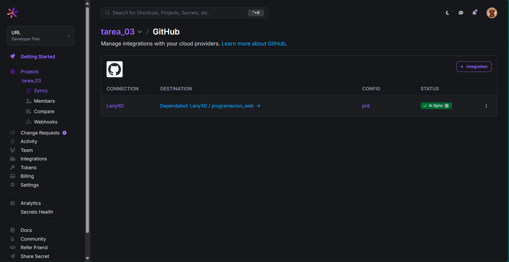
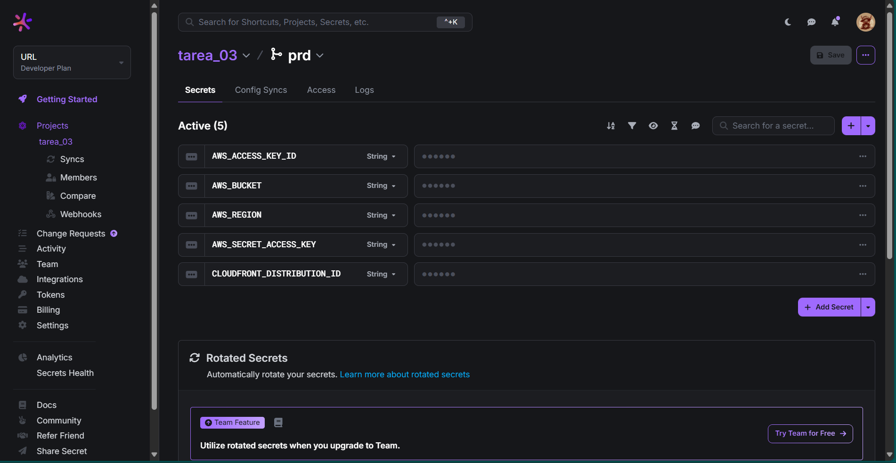
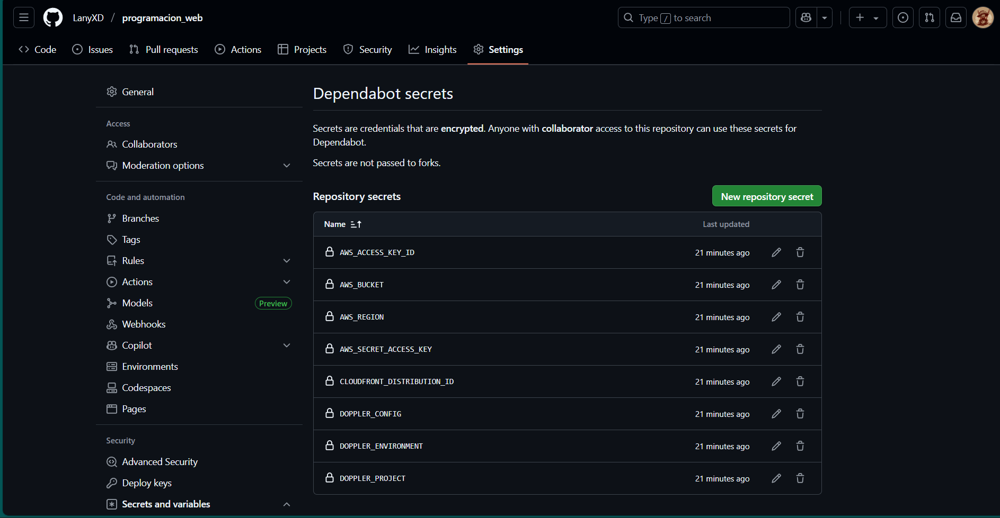

# Tarea 03 - Despliegue a CDN con Vite, Doppler, S3 y CloudFront

## 📌 Descripción
Proyecto de la **Tarea 02** adaptado para utilizar **Vite** y desplegado en **AWS S3 + CloudFront** usando un **pipeline de GitHub Actions** con credenciales almacenadas en **Doppler**.

---

## 📂 Capturas solicitadas

### 1️⃣ Config Syncs en Doppler



### 2️⃣ Variables en Doppler



### 3️⃣ Secretos en GitHub



---

## 🌐 URL del CDN
[Enlace al sitio desplegado](https://d1pokngwgmqypn.cloudfront.net)  


---

## ⚙️ Tecnologías utilizadas
- **Vite** para construcción del proyecto.
- **AWS S3** como almacenamiento estático.
- **AWS CloudFront** como CDN.
- **Doppler** para manejo de credenciales.
- **GitHub Actions** para CI/CD.

---

## 📜 Pasos para ejecución local
1. Clonar el repositorio:
   ```bash
   git clone https://github.com/usuario/programacion_web.git
   cd programacion_web
   git checkout tarea-03

2. Instalar dependencias:
   ```bash
   npm install

3. Ejecutar en desarrollo:
   ```bash
   npm run dev

4. Generar build de producción:
   ```bash
   npm run build
   