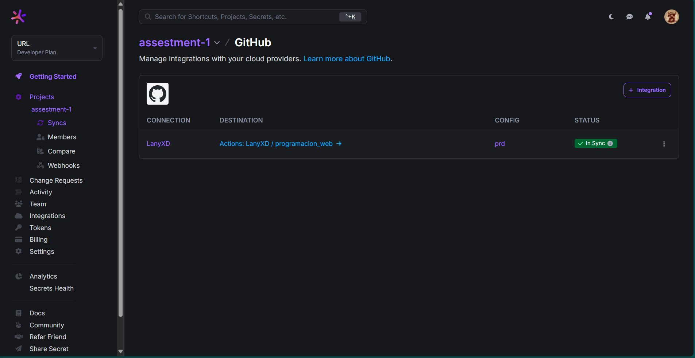
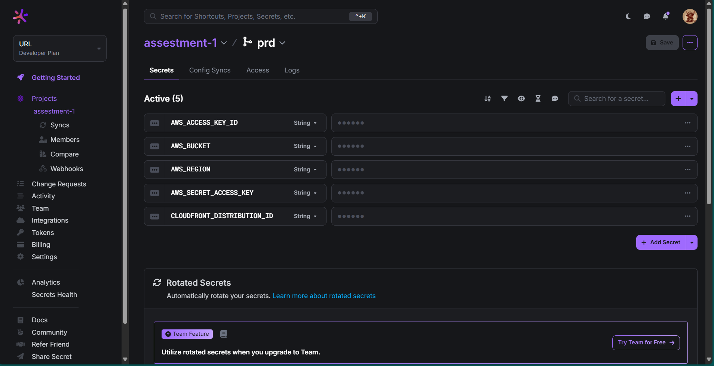
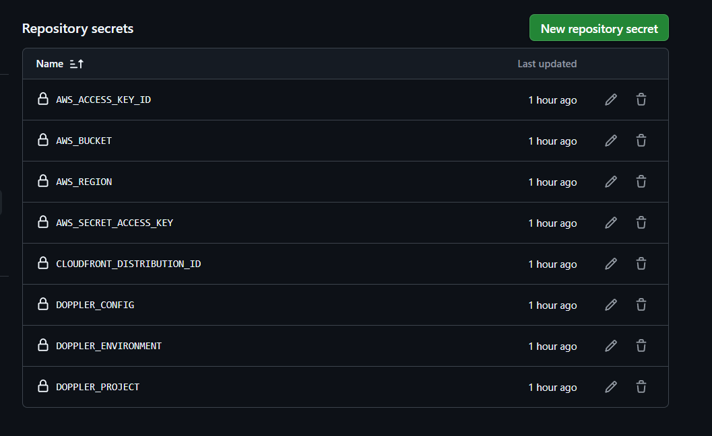
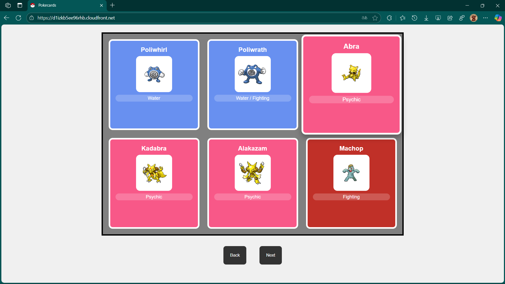

# Pokémon Gallery Web App (Assessment 1)

## Description
This application displays a gallery of cards with Pokémon information dynamically obtained from the **PokeAPI**. The project is deployed on **AWS CloudFront**.

---

## 📸 Doppler

- **Config Syncs**  

- **Variables de Doppler**  

---

## 🔐 GitHub Secret

---

## 📸 App

Working Pokémon Gallery:  

---

## 🌐 URL pública del CDN

[https://tu-cloudfront-url.amazonaws.com](https://d1izkb5ee96rhb.cloudfront.net)
